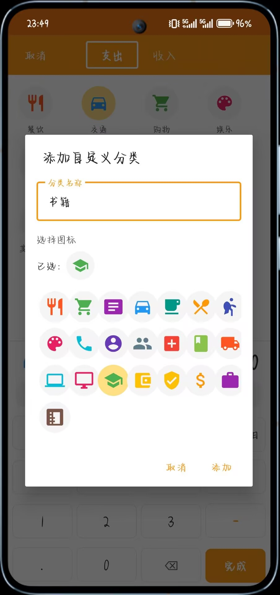
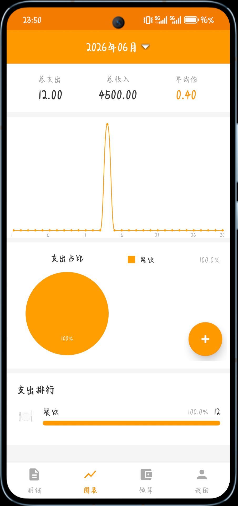

# AccountBook

[中文](README_zh.md)

> This project was entirely developed by AI (MiMo Code Agent).

## Screenshots

| 明细 | 添加记录 |
|------|----------|
|  |  |

| 类型 | 图表 |
|------|------|
|  |  |

## Overview

AccountBook is designed to help users track daily income and expenses with a clean, intuitive interface. It supports custom categories, budget management, statistical analysis, and auto-recording templates.

## Features

- **Record Management**: Quickly add income and expense records with amount, category, date, and notes
- **Category System**: 14 built-in categories (9 expense, 5 income) with custom icons; supports user-defined categories
- **Statistical Charts**: Pie chart for category distribution, line chart for monthly trends
- **Budget Control**: Set monthly budgets per category with progress tracking
- **Auto Record Templates**: Create reusable templates for recurring transactions
- **Date Filtering**: Filter records by date range
- **Material Design UI**: Bottom navigation, FAB for quick add, custom date picker

## Tech Stack

| Component | Technology |
|-----------|------------|
| Language | Kotlin 1.9.22 |
| Min SDK | 26 (Android 8.0) |
| Target SDK | 34 |
| Architecture | MVVM |
| Database | Room 2.6.1 |
| UI Components | Material Design 1.11.0, MPAndroidChart 3.1.0 |
| Async | Coroutines, LiveData |
| Build Tool | Gradle 8.13, AGP 8.13.2 |

## Project Structure

```
app/src/main/java/com/example/accountbook/
├── data/
│   ├── entity/          # Room entities: Record, Category, Budget, AutoRecordTemplate
│   ├── dao/             # Data access objects
│   ├── repository/      # Repository layer
│   └── AppDatabase.kt   # Room database singleton
├── ui/
│   ├── activity/        # AddRecord, ManageCategories, AutoRecord, AmountInput
│   ├── fragment/        # Home, Statistics, Budget, Settings
│   ├── adapter/         # RecyclerView adapters
│   ├── view/            # PieChartView, LineChartView, WheelDatePickerDialog, DraggableView
│   └── viewmodel/       # ViewModels for each feature
└── utils/
    └── CategoryIconHelper.kt
```

## Build

```bash
# Debug build
./gradlew assembleDebug

# Release build
./gradlew assembleRelease

# Clean build
./gradlew clean assembleDebug
```

## Database

- Database name: `account_book_database`
- Version: 1
- Auto-seeds 14 default categories on first launch
- Schema export is disabled

## Notes

- Chinese UI strings are hardcoded in entities, not in `strings.xml`
- Uses Aliyun Maven mirrors with fallback to Google/Maven Central
- Room uses kapt annotation processor

## License

[MIT](LICENSE)
